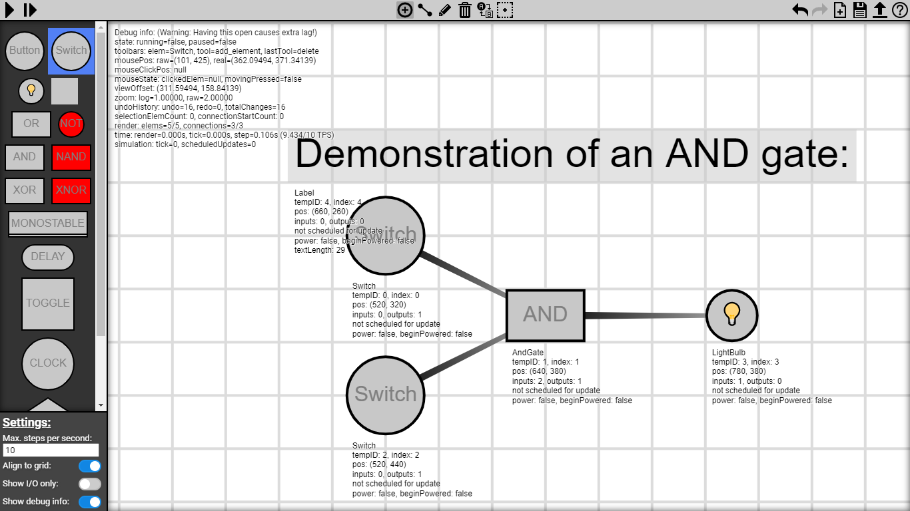

# Logicboard

Logic circuit editor and simulator made in pure JavaScript (no dependencies) as part of my university thesis in 2022.

### [[Run it live here](https://tomlacko.github.io/Logicboard)]

Tip: Try opening pre-made example circuits from here: https://github.com/Tomlacko/Logicboard/tree/main/examples

### Image preview:

---

## About this application:

This is a logic circuit editor and simulator implemented in HTML5 and JavaScript (ECMAScript 2017), and rendered using a 2D canvas.

The aim of this application is to provide a simple yet effective way of designing, simulating, demonstrating and experimenting with logic circuits in a very approachable way.

In this app, a logic circuit is represented as a simple directed graph, where each node (vertex) is one logic element, and every edge represents a connection going from a source element to a target element. Self-loops and parallel (duplicate) connections aren't allowed.  
Input elements (namely switches and buttons) can only act as source elements, meaning connections can only lead out of them, not into them, while output elements (namely the light bulb and display tile) are the opposite - they only work as targets, meaning that connections can only lead into them, not out of them.  
There is, however, no limit to how many connections can lead into/out of an element.  
You can identify the direction of every connection based on its color gradient and width; connections start out wide and strongly colored at the source, and gradually fade and thin out towards the target.

Elements rendered as red are currently activated (powered), while gray ones are unpowered.  
During simulation, every activated element will send out power over all outgoing connections to all of its target elements. Every element reacts differently upon receiving/losing power; the behavior depends on the type of the logic element. For example, an AND gate will only activate if it's receiving power from all of its inputs, while an OR gate will activate if it receives power from any of its inputs.

Elements can be placed, moved, edited, connected, deleted, replaced and selected only while the simulation isn't running, which is referred to as "edit mode". During edit mode, elements can't be triggered and they don't send out power. Meanwhile in simulation mode, the exact opposite is true. In there, elements send power over outgoing connections and input elements can be clicked on, but no modification to the structure of the circuit can be made. Stopping the simulation and going back to edit mode will reset the circuit back to its initial state again.

## Interface & functionality:

- ### Top bar:
  - #### Simulation controls (top left corner):
    - **Start/Stop** - Switches between simulation mode and edit mode. Stopping the simulation will reset it.
    - **Pause/Continue** - Pauses/resumes the simulation without resetting it.
    - **Step** - Allows for manually stepping the simulation step by step.
    - **Step counter** - While simulating, displays the current step number/count.
  - #### Tools (top middle):
    - **Add Element** - Allows elements to be placed when clicking on the canvas, depending on which element on the sidebar is selected.
    - **Connect Elements** - Allows elements to be connected with a power line. Clicking on the first (source) element starts the connection, then clicking on the second (target/destination) element creates/places the connection between these two elements going in the given direction.  
      Clicking on an empty spot cancels the connection creation.  
      Clicking on an existing connection will pick it back up and allows it to be rewired elsewhere. Holding the left CTRL key allows for multiple connections to be clicked and rewired simultaneously.  
      Additionally, holding the left CTRL key keeps the connection creation active even after placing one, allowing for multiple target elements to be more easily connected to the source ones.  
      When a selection of multiple elements is clicked, connections are started from all the selected elements at once. The same applies for when the secondary click lands on an selected element; this will wire all held connections to every selected element.
    - **Edit** - Clicking on an element with this tool will edit it. The exact way an element can be edited depends on each element, however, most elements support their initial power state being edited, which defines what state will the element be in at the beginning of a simulation.  
      Clicking on a connection will also allow you to connect it elsewhere (same rules as for the Connect Elements tool apply here too).  
      When clicking on a selection of multiple elements, all the elements of the same type will be edited at once.
    - **Delete** - Clicking on an element or selection of elements will delete it.  
      Clicking on a connection will also delete that connection.
    - **Replace** - Clicking on an element will replace it based on the element selected in the sidebar, creating a new element in the old element's place with the same connections if possible. If multiple elements are selected, all will be replaced.  
      If a connection is clicked instead, the new element will be placed on the connection, rewiring the connection through itself (acting as a middleman).  
      Lastly, if an element (or a selection of elements) is clicked while the element of the same type is selected, the element(s) will get replaced by a connection instead, connecting all of its inputs with all of its outputs, before deleting itself. If no such connection is possible, nothing will happen.
    - **Select Elements** - With this tool selected, you can create a selection of multiple elements by clicking and dragging a selection area over the elements, or by clicking on each element individually.  
      Clicking on an empty spot will cancel the current selection and switch back to the previously used tool. The same will happen while starting a new selection, unless the left CTRL key is being held, in which case any new selection will get added to the existing one, and the tool will never be switched. Additionally, clicking an element with the left CTRL key held will toggle it between selected and unselected.
  - #### Actions & other buttons (top right corner):
    - **Undo/Redo** - Reverts/redoes changes that have been made, one by one.
    - **New Project** - Deletes everything from the canvas and resets everything to initial values. Revertable via undo.
    - **Save To File** - Opens a save file dialog, allowing the project to be saved to a file locally and reopened later. The file format is JSON.
    - **Load From File** - Opens a open file dialog, which allows any previously saved file to be opened and loaded again.
    - **Show Info** - Opens this overlay with info and explanations.
- ### Left sidebar:
  - #### Element selector:
    - **Input button** - Buttons serve as inputs to the running circuit. Clicking a button during simulation will keep it powered on for as long as the mouse is being held down.  
      Connections cannot lead into this element, they can only lead out.  
      Editing this element will toggle if it should start already powered or not.
    - **Input switch** - Switches serve as inputs to the running circuit. Clicking a switch during simulation will toggle it between being powered and unpowered.  
      Otherwise they work the same as buttons.
    - **Output light bulb** - Light bulbs serve as visual outputs of the circuit. The light bulb will be turned on as long as it receives power from any of its incoming connections.  
      Connections cannot be created from this element, they can only lead into it.  
      Editing this element will toggle if it should start already powered or not.
    - **Output display tile** - Display tiles serve as visual outputs of the circuit, especially for creating multi-element displays by placing them next to each other.  
      They work the same way as light bulb elements.
    - **OR Gate** - Powered when receiving power from 1 or more incoming connections, otherwise unpowered.  
      Editing this element will toggle if it should start already powered or not.
    - **NOT Gate** - Powered, unless receiving power from 1 or more incoming connections, otherwise powered.  
      Editing this element will toggle if it should start already unpowered or not.
    - **AND Gate** - Powered when receiving power from all incoming connections at once, otherwise unpowered.  
      Editing this element will toggle if it should start already powered or not.
    - **NAND Gate** - Powered, unless receiving power from all incoming connections at once.  
      Editing this element will toggle if it should start already unpowered or not.
    - **XOR Gate** - Powered if receiving power from an odd number of incoming connections, otherwise unpowered.  
      Editing this element will toggle if it should start already powered or not.
    - **XNOR Gate** - Powered, unless receiving power from an odd number of incoming connections. In other words, powered when receiving power from an even number of incoming connections.  
      Editing this element will toggle if it should start already unpowered or not.
    - **Monostable circuit** - Monostable circuits stay in an unpowered state until a change in incoming power is detected, upon which they produce a single pulse of power and return back to the unpowered state, producing no more output until triggered again.  
      The exact behavior depends on the type of the element, which can be cycled through by editing it.  
      Rising-edge is the default setting (visualized with an extra line at the bottom), in which a pulse is created whenever the element receives any power for the first time. Power must stop being received until another pulse can be created.  
      Falling-edge is the second setting (visualized with an extra line at the top). In this setting, a pulse is created every time power stops being received.  
      Dual-edge is the final setting (visualized with extra lines on top and bottom). In this setting, a pulse is created both on receiving power and losing power.  
      The most common usage is using a rising-edge monostable circuit for pulse shortening.
    - **Delay** - When any power is received, a countdown is started. The element stays unpowered until 1 is reached, upon which the countdown is reset, the element gets powered on, and stays powered as long as it's receiving some power. When power stops being received, the countdown starts counting down to 1 again. If power is resumed during this, the countdown gets immediately reset again, otherwise if 1 is reached, the element gets unpowered.  
      The length of the countdown (=delay) has to be specified when placing down the element, but it can also be edited later.  
      The minimum delay is 1, in which case the element will act exactly like an OR gate, because every element takes at least 1 step to update.
    - **Toggle Flip-Flop** - This element acts as a switch toggleable by receiving power. When any power is received, the power state of this element will get toggled to the opposite state of what it's currently in. Before the element can be toggled again, it must first stop receiving power for any new pulse to be detectable.  
      Editing this element will toggle if it should start already powered or not.
    - **Clock Pulser** - The clock element will start as unpowered, and will automatically count down. Upon reaching 0, a single pulse of power will be produced. In the next step, the element will get unpowered and the countdown will reset back to its initial value, and begin counting down again.  
      If any power gets received at any point, the clock will immediately reset to the initial value and freeze there, staying unpowered until power stops being received.  
      The length of the countdown (=delay) has to be specified when placing down the element, but it can also be edited later.  
      The minimum delay is 0, in which case the element will act exactly like a NOT gate, because the clock will be constantly powered on, unless receiving power.
    - **Randomizer** - If this element receives any power, it has a 50% chance of getting powered. Whether it chooses to be powered or not, it will stay in the chosen state until it stops receiving power again, upon which it will return to its initial state.  
      This element cannot be edited.
    - **Label** - Allows for text to be placed onto the canvas, which is useful for labeling parts of the circuit (such as inputs, etc.).  
      The displayed text has to be specified when placing down the element, but it can also be edited later.  
      As it exists purely for visual purposes, it cannot interact with the circuit in any way.
  - #### Settings:
    - **Max. steps per second** - This sets how many simulation steps should be performed every second. Note, however, that due to performance reasons, the simulator might not always be able to reach this desired amount.
    - **Align to grid** - When this toggle is enabled, the position of all newly placed/dragged elements will be aligned to the grid (specifically, to every half-step of the grid).
    - **Show I/O only:** - When this toggle is enabled, then during simulation, only input and output elements are drawn (and also labels) to drastically improve simulation performance by skipping everything else. This is most useful when working with a big circuit, where speed is key and the reaction of outputs to inputs is what matters the most.
    - **Show debug info** - Displays the values of many important variables and shows other interesting values. Additionally, debug info gets drawn under every element on the canvas.
- ### The canvas & input methods
  - #### Mouse controls:
    - **Panning** - Clicking and dragging on any empty spot on the canvas will move the canvas along with the mouse.
    - **Element dragging** - Clicking and dragging on any element will move it along with the mouse.
    - **Edge autopanning** - While dragging an element or creating a selection, moving the mouse close to the edge of the canvas will automatically start moving the canvas in the same direction.
    - **Zooming** - Scrolling with the mouse scroll wheel will zoom in/out on the spot the mouse is currently at.
    - **Save as image** - While this isn't functionality specific to this app, it's worth mentioning that right clicking on the canvas allows for saving its contents as an image.
  - #### Touch controls:
    - **Warning!** - Unfortunately, touch controls aren't fully supported. They do, however, work on a basic level by mimicking mouse controls.
    - **Zooming** - Touching with 2 or more fingers and moving up and down will zoom the canvas in and out respectively.
    - **Copying and pasting** - This feature is unfortunately inaccessible from touch controls, as it requires keyboard shortcuts.
  - #### Keyboard controls, hotkeys and shortcuts:
    - **Space** - Toggles between edit and simulation mode. In other words, starts/stops the simulation.
    - **Escape** - Closes this info overlay, otherwise cancels any current action, be it connection creation, element dragging, panning, selecting or clicking.  
      If none of those actions are currently being performed, then this key can also stop the simulation if it's running, switch back to the previous tool if the selection tool is currently selected, and lastly, deselects any selected elements, all in this particular priority order.
    - **P** - Pauses/unpauses the simulation (assuming it is already running).
    - **. (>)** - Manually steps the simulation forward by 1 step.
    - **Arrow keys:** - Pressing the arrow keys will move (pan) the canvas in the given direction.
    - **~ (Grave)** - Toggles debug info between shown/hidden.
    - **G** - Toggles aligning to grid between active/disabled.
    - **Z** - Undo (undoes the latest action).
    - **Y** - Redo (redoes the latest action).
    - **A** - Selects all elements in the simulator.
    - **I** - Inverts the current element selection. All elements that have been selected before will stop being selected, and vice versa.
    - **C** - Copies all selected elements onto a fake clipboard (not the actual clipboard, since that requires special permissions for pasting).
    - **X** - Cuts all selected elements, saving them onto a fake clipboard, and deleting the existing selected elements.
    - **V** - Pastes all the elements stored on the fake clipboard under the current mouse position and selects them.
    - **Delete** - Deletes the currently selected elements.
    - **Q** - Selects the "Add Element" tool.
    - **W** - Selects the "Connect Elements" tool.
    - **E** - Selects the "Edit" tool.
    - **D** - Selects the "Delete" tool.
    - **R** - Selects the "Replace" tool.
    - **S** - Selects the "Select Elements" tool.
    - **Left CTRL** - All the hotkeys work without CTRL being held. The key does, however, modify the functionality of certain actions, specifically connection creation and selection creation, which is described in their respective sections.
  - #### Drag & Drop:
    - Dragging and dropping a file over the canvas will automatically load it.

---

### More image previews:

Edit mode:

Debug mode:

